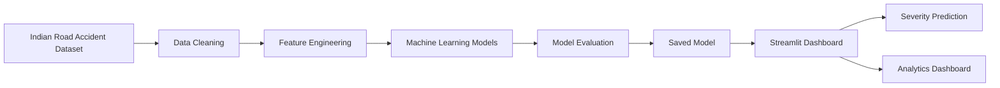
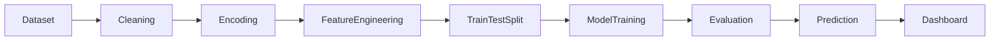
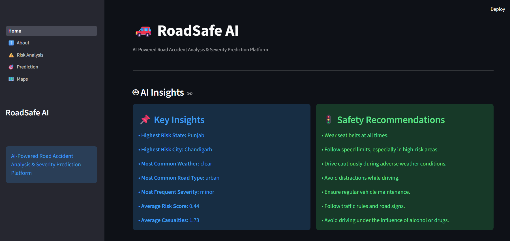
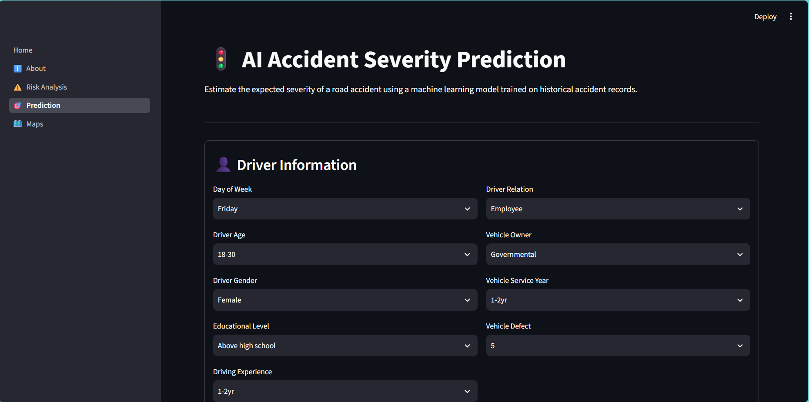
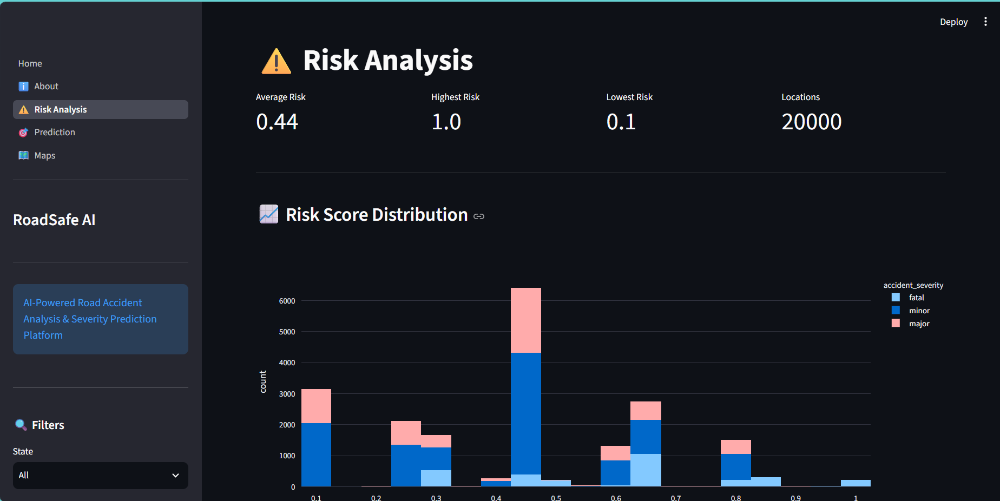

<div align="center">

# 🚗 RoadSafe AI

### AI-Powered Indian Road Accident Analysis & Severity Prediction Platform

<p align="center">

</p>

<p align="center">


</p>

<p align="center">
An intelligent Machine Learning platform that analyzes Indian road accident data, predicts accident severity, and provides interactive dashboards for data-driven road safety insights.
</p>

</div>

---

# 📖 Overview

RoadSafe AI is an end-to-end Machine Learning application developed to analyze Indian road accident datasets and predict accident severity. The project combines data preprocessing, feature engineering, model training, evaluation, and an interactive Streamlit dashboard into one platform.

The objective is to help researchers, students, and transportation authorities understand accident patterns and generate actionable insights using AI.

---

# ✨ Features

| Feature | Description |
|---------|-------------|
| 📊 Interactive Dashboard | Visualize accident statistics and trends |
| 🤖 Severity Prediction | Predict accident severity using ML |
| 📈 Data Analytics | Generate insights through charts and graphs |
| 🧹 Data Preprocessing | Automated cleaning and feature engineering |
| 🧠 Machine Learning | Model training and evaluation |
| 📂 Dataset Management | Support for multiple accident datasets |
| ⚡ Fast Web Interface | Streamlit-powered interactive application |

---

# 🏗️ System Architecture



---

# 🤖 Machine Learning Pipeline



---

# 📂 Project Structure

```text
RoadSafeAI
│
├── assets
│
├── components
│
├── pages
│
├── services
│
├── training
│
├── models
│
├── data
│   ├── raw
│   └── processed
│
├── Home.py
├── config.py
├── requirements.txt
├── README.md
└── .gitignore
```

---

# 🛠️ Tech Stack

| Category | Technologies |
|----------|--------------|
| Programming | Python |
| Frontend | Streamlit |
| Machine Learning | Scikit-Learn |
| Data Analysis | Pandas, NumPy |
| Visualization | Plotly, Matplotlib |
| Model Serialization | Joblib |
| Version Control | Git & GitHub |

---

# 📸 Application Preview

## 🏠 Dashboard

<p align="center">

</p>

---

## 🤖 Prediction Page

<p align="center">

</p>

---

## 📊 Analytics

<p align="center">

</p>

---

# 🚀 Installation

## Clone Repository

```bash
git clone https://github.com/roopeshARR/RoadSafeAI.git
```

## Navigate to Project

```bash
cd RoadSafeAI
```

## Create Virtual Environment

```bash
python -m venv .venv
```

## Activate Environment

### Windows

```bash
.venv\Scripts\activate
```

### Linux / macOS

```bash
source .venv/bin/activate
```

## Install Dependencies

```bash
pip install -r requirements.txt
```

## Run Application

```bash
streamlit run Home.py
```

---

# 📊 Workflow

```text
Indian Road Accident Dataset
            │
            ▼
     Data Preprocessing
            │
            ▼
   Feature Engineering
            │
            ▼
 Machine Learning Models
            │
            ▼
    Model Evaluation
            │
            ▼
    Severity Prediction
            │
            ▼
 Interactive Dashboard
```

---

# 📈 Dashboard Modules

- 🏠 Home Dashboard
- 📊 Accident Analytics
- 🤖 Severity Prediction
- 📈 Trend Analysis
- 📉 Risk Assessment
- 📋 Machine Learning Insights

---

# 📂 Dataset

The project is designed to work with Indian road accident datasets.

Datasets are processed through:

- Data Cleaning
- Missing Value Handling
- Feature Engineering
- Model Training
- Severity Prediction

> **Note:** Large datasets may not be included in the repository because of GitHub storage limits. Replace them with your own datasets if necessary.

---

# 🎯 Future Roadmap

- ✅ Interactive Dashboard
- ✅ Accident Severity Prediction
- ✅ Machine Learning Pipeline
- ✅ Data Analytics
- 🔲 Deep Learning Models
- 🔲 Explainable AI (XAI)
- 🔲 Real-Time Traffic Integration
- 🔲 Weather API Integration
- 🔲 Cloud Deployment
- 🔲 Mobile Application

---

# 👨‍💻 Author

### **Avuthu Roopesh Reddy**

🎓 B.Tech Electronics & Communication Engineering  
🏫 Anurag University

📧 **Email**  
avuthuroopeshreddy@gmail.com

💻 **GitHub**  
https://github.com/roopeshARR

🔗 **LinkedIn**  
https://www.linkedin.com/in/avuthu-roopesh-reddy-09938b315/

---


<div align="center">

### 🚗 Building Safer Roads Through Artificial Intelligence

**Made with ❤️ by Avuthu Roopesh Reddy**

</div>
